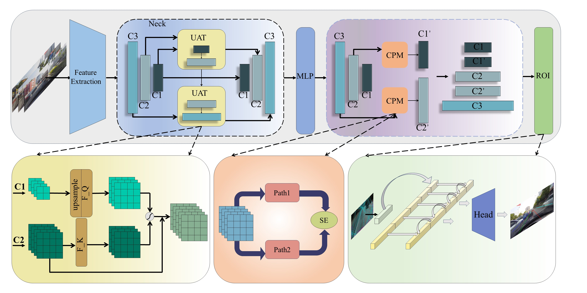

<div align="center">

# The accuracy of lane detection is improved by feature replication

</div>


## Introduction

- Lane detection is a pivotal component in automated and assisted driving systems. Lane markings, akin to traffic signs in providing advanced semantic information, present challenges for traditional methods.  Despite incorporating some semantic fusion, these methods encounter limitations in fine-grained feature extraction. This constraint impedes the capture of essential features, including lane shape and position, especially in complex environments. To capture more profound features, this paper introduces an innovative model utilizing replicated feature enhancement strategies to improve the accuracy and robustness of lane detection. The proposed model accomplishes adaptive optimization of region of interest representation via a multi-scale fusion network. Subsequently, it refines feature representation using a combination of dilated convolutions and attention mechanisms. In conclusion, experiments conducted on CuLane and Tusimple datasets demonstrate the superiority of our proposed method in terms of both accuracy and robustness in lane detection. Across a range of evaluation metrics, our model consistently outperforms the state-of-the-art methods. Notably, our model attains an impressive F1 score of 80.60\% on the Culane dataset, a substantial improvement over the performance of the 12 mainstream algorithms included in the evaluation. Across tests encompassing 8 challenging scenarios, the model exhibited its optimal performance in a diverse range of situations. The outcomes of this study are anticipated to provide valuable insights for addressing lane detection challenges in both automated driving and assisted driving systems.

## Installation

### Prerequisites
Only test on Ubuntu18.04 and 20.04 with:
- Python >= 3.8 (tested with Python3.8)
- PyTorch >= 1.6 (tested with Pytorch1.6)
- CUDA (tested with cuda11.3)
- Other dependencies described in `requirements.txt`


### Create a conda virtual environment and activate it (conda is optional)

```Shell
conda create -n LDFR python=3.8 -y
conda activate LDFR
```

### Install dependencies

```Shell

pip install torch==1.8.0 torchvision==0.9.0

python setup.py build develop
```

## Getting Started

### Training
For training, run
```Shell
python main.py [configs/path_to_your_config] --gpus [gpu_num]
```

For example, run
```Shell
python main.py configs/ldfr/resnet18_culane.py --gpus 0
```

### Validation
For testing, run
```Shell
python main.py [configs/path_to_your_config] --[test|validate] --load_from [path_to_your_model] --gpus [gpu_num]
```

For example, run
```Shell
python main.py configs/ldfr/dla34_culane.py --validate --load_from culane_dla34.pth --gpus 0
```

Currently, this code can output the visualization result when testing, just add `--view`.
We will get the visualization result in `work_dirs/xxx/xxx/visualization`.
